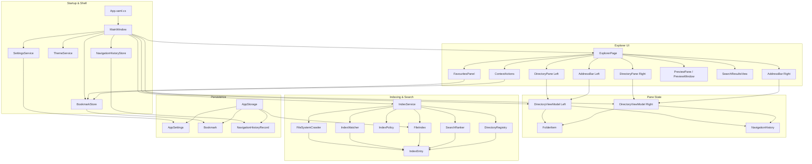

# Filey Codebase Context Graph

## Purpose
Filey is a WPF-based dual-pane file manager for browsing folders, previewing files, indexing content for fast search, and persisting user preferences and navigation state.

## Context Graph

The graph below is a simplified, implementation-focused view of the app’s main architecture.

## Technology Stack and Dependencies

### Primary stack
- Runtime: .NET Framework 4.8 with WPF for the desktop UI.
- Language: C# with XAML for views and UI composition.
- Build model: old-style .NET Framework project file and solution file, compiled with MSBuild.

### Main libraries and dependencies
- WPF / PresentationFramework for windows, pages, controls, and styling.
- WPF-UI (Wpf.Ui 4.3.0) for modern Fluent UI components, theme management (Wpf.Ui.Appearance), and title bar integration.
- Newtonsoft.Json (13.0.4) for serializing settings, bookmarks, history, and the file index to JSON.
- FuzzySharp (2.0.2) for fuzzy string matching and ranking in search results.
- CommunityToolkit.Mvvm (8.4.2) for MVVM patterns and property change notifications.
- OpenMcdf (3.1.4) for reading and decrypting Excel workbooks (Compound Document Format).
- Microsoft.Web.WebView2 (1.0.4022.49) for rendering HTML content in the preview pane.
- System.IO / System.Threading / System.Collections.Concurrent for filesystem traversal and background indexing.
- Windows interop APIs (user32.dll, dwmapi.dll) for single-instance activation, foreground window management, and dark mode window attributes.

### Notable implementation concerns
- The app is desktop-native and uses Windows-specific UI and file-system behavior.
- Indexing runs asynchronously in the background to keep navigation and search responsive.
- Persistence is lightweight and file-based rather than using a database.
- Preview support is implemented through custom renderer helpers for markdown, PDF, and image content.

## Node Summary

- **App entrypoint (App.xaml.cs)**
  - Starts the WPF application, enforces single-instance behavior via a global mutex, and launches MainWindow.

- **MainWindow**
  - Owns the shell UI, creates both DirectoryViewModel instances (left and right panes), initializes and navigates between Explorer, Settings, and Crawler Status pages, loads persisted app state (settings, bookmarks, navigation history), and triggers IndexService startup and warm-root refreshes on window activation.

- **ExplorerPage**
  - Hosts the dual-pane browsing experience, creates and manages DirectoryPane instances for each side, AddressBar navigation toolbars (LeftAddressBar, RightAddressBar), preview pane/window, search overlays (SearchResultsView), favorites panel (LeftFavouritesPanel), and handles right-pane mode switching (Off, PreviewPane, RightPane/Dual).

- **DirectoryViewModel**
  - Represents the state of each pane: current directory path, folder/file collections, selection, and refresh behavior. Owns a NavigationHistory instance for back/forward navigation. Projects filesystem state into FolderItem models for display. Separate instances for left and right panes allow independent navigation.

- **FolderItem**
  - UI model for a single file or folder row: name, path, size, modification date, icon, and edit state. Derived from IndexEntry entries in search results or loaded from the live filesystem for the current directory.

- **DirectoryPane**
  - User control that displays a single directory's contents as a browsable tree/list. Receives a DirectoryViewModel and Side (Left/Right) property to configure layout and behavior.

- **PreviewPane / PreviewWindow**
  - Multi-format preview renderers for files displayed in the right pane (PreviewPane) or as a floating window (PreviewWindow). Support PDF (with page navigation and zoom), Markdown (rendered to HTML via MarkdownRenderer), text files, images (with rotation and zoom), and HTML content via WebView2. PreviewPane can be toggled into/out of ExplorerPage layout.

- **SearchResultsView**
  - Information-dense overlay that displays full ranked search results from the index. Rows are sortable by column and activation raises ResultActivated event for navigation.

- **FavouritesPanel**
  - Displays bookmarks grouped by category. Supports drag-and-drop reorganization and navigation to bookmarked paths. Connected to the global BookmarkStore singleton.

- **AddressBar**
  - Navigation toolbar for each pane (LeftAddressBar and RightAddressBar). Provides breadcrumb/path display, search/query input with autocomplete results, back/forward/home buttons, and home directory switching. Raises events for navigation, search, and history actions.

- **ContextActions**
  - Static helper for context menu operations (rename, delete, etc.) on files and folders. Also provides ExcelDecryptor integration for bulk Excel workbook decryption (password removal via managed code, no Excel or COM required).

- **ExcelDecryptor**
  - Managed-code Excel workbook decryption (using OpenMcdf). Supports Agile-encrypted .xlsx/.xlsm files. Removes the open (encryption) password entirely, saving a password-free copy alongside each original. Byte-preserving, so macros and formatting survive intact.

- **IndexService (singleton)**
  - Central orchestrator for the search index. Loads the persisted index on startup, kicks off background crawls for seed roots via FileSystemCrawler, manages live file watchers (IndexWatcher) for hot roots, periodically refreshes warm roots (history-derived paths), and provides the search API for the UI.

- **FileIndex**
  - Thread-safe in-memory store of IndexEntry objects, indexed by full path. Supports fuzzy ranked search (via SearchRanker) and JSON persistence through AppStorage.

- **FileSystemCrawler**
  - Scans seed roots (with bounded concurrency using SemaphoreSlim) using NativeDirectoryEnumerator, respects IndexPolicy rules to skip excluded folders, and populates the FileIndex with discovered entries. Performs iterative depth-first traversal with a safety cap (MaxEntriesPerRoot) to prevent index bloat from huge directory trees.

- **NativeDirectoryEnumerator**
  - Low-level filesystem API wrapper for efficient directory enumeration. Used by FileSystemCrawler to traverse folder hierarchies while respecting system folder shortcuts and reparse points.

- **IndexEntry**
  - One indexed file or folder record: name, path, parent ID, size, modification time, and directory flag. Deliberately minimal to keep memory footprint low for tens of thousands of entries. ToFolderItem() projects entries into the UI row model.

- **IndexWatcher**
  - Live file-system watcher for hot roots. Detects file creation, deletion, and modification and incrementally updates the index in real-time.

- **IndexPolicy**
  - Single source of truth for "selective" indexing: decides WHICH folders get indexed/watched (seed roots, hot/warm tiers based on likelihood of user visit) and WHICH subtrees are skipped (system folders, junk, junctions). Computes roots by merging shell folders, bookmarks, home paths, and navigation history. Handles nesting so no root is contained inside another, and enforces a depth cap (12 levels) to bound index size.

- **SearchRanker**
  - Ranks IndexEntry candidates against a query using FuzzySharp scoring with a prefix/substring bonus and proximity to the active directory. Reused by both the index search and local directory search.

- **DirectoryRegistry**
  - Singleton that maintains DirectoryNode records for all indexed directories. Provides path analysis and segment matching to support search proximity bonuses.

- **BookmarkStore (singleton)**
  - In-memory store for global bookmarks/favorites. Bookmarks are shared across both panes and persisted to bookmarks.json via AppStorage.

- **NavigationHistory**
  - Back/forward stacks for a single pane. Caps retained entries and invalidates the forward stack when a new navigation occurs.

- **NavigationHistoryStore**
  - Loads and saves NavigationHistoryRecord (both panes' back stacks) to history.json via AppStorage.

- **SettingsService**
  - Loads and saves AppSettings to settings.json. Returns default settings if the file is absent or malformed.

- **AppSettings**
  - Configuration model (theme, compact mode, home paths, right-pane mode, etc.) persisted by SettingsService.

- **CrawlerStatusPage**
  - Status page showing IndexService diagnostics: indexed entry count, watcher count, and list of configured roots. Updates periodically via a DispatcherTimer.

- **Settings subsystem**
  - AppSettings (configuration model) is loaded by SettingsService on startup and passed to MainWindow, where it drives UI state and feature toggles.

- **Persistence and state**
  - BookmarkStore, NavigationHistory/NavigationHistoryStore, and DirectoryRegistry maintain user-specific state across sessions.

## Relationship Notes

- **App startup flow**: App.xaml.cs enforces single-instance via global mutex, then creates and shows MainWindow.

- **UI shell initialization**: MainWindow creates both DirectoryViewModel instances, loads AppSettings via SettingsService, loads BookmarkStore and NavigationHistoryStore from disk, and wires them to the UI before launching IndexService on the Loaded event.

- **Explorer UI composition**: ExplorerPage receives both DirectoryViewModel instances from MainWindow and creates corresponding DirectoryPane instances, search overlays (SearchResultsView), AddressBar instances (LeftAddressBar, RightAddressBar), preview pane/window, and the favorites panel (LeftFavouritesPanel). DirectoryPane is a generic control that adapts to Left or Right via dependency properties. AddressBar handles all navigation, search, and history actions for its pane.

- **Navigation flow**: User interacts with AddressBar (breadcrumb, search box, navigation buttons) or DirectoryPane (folder selection). Both trigger DirectoryViewModel.LoadDirectory(), which updates CurrentDirectory, loads contents asynchronously, and triggers IndexService to prioritize that directory for search. NavigationHistory is updated on navigation away.

- **Preview rendering**: PreviewPane and PreviewWindow use specialized renderers—PdfRenderer for PDFs, MarkdownRenderer for markdown, ImageView for images, WebView2 for HTML—selected by file extension.

- **Indexing pipeline**: IndexService coordinates three subsystems:
  1. FileSystemCrawler scans seed roots asynchronously and populates FileIndex.
  2. IndexWatcher monitors hot roots for real-time changes.
  3. Warm-root refresh timer periodically recrawls history-derived paths.
  - SearchRanker and DirectoryRegistry support proximity-aware search scoring.

- **Search flow**: User query → SearchRanker ranks FileIndex entries → UI displays FolderItem results in SearchResultsView with rank position.

- **State persistence**:
  - Settings (AppSettings) → settings.json via SettingsService
  - Bookmarks (Bookmark collection) → bookmarks.json via BookmarkStore
  - Navigation history (NavigationHistoryRecord) → history.json via NavigationHistoryStore
  - File index (IndexEntry collection) → index.json via FileIndex

- **Navigation and history**: DirectoryViewModel owns a NavigationHistory instance for each pane (back/forward stacks). On shutdown, MainWindow persists both stacks as NavigationHistoryRecord.

- **Singleton pattern**: IndexService, BookmarkStore, and DirectoryRegistry follow a Lazy<T> singleton pattern for thread-safe, lazy initialization.

- **Settings-driven behavior**: AppSettings controls theme application (via ThemeService), compact mode, home directories, and right-pane mode (Off, Preview, Dual).

- **Diagnostics and monitoring**: CrawlerStatusPage connects to IndexService.Instance to display live statistics (indexed count, watcher count, root list) and supports manual re-crawl triggers.
